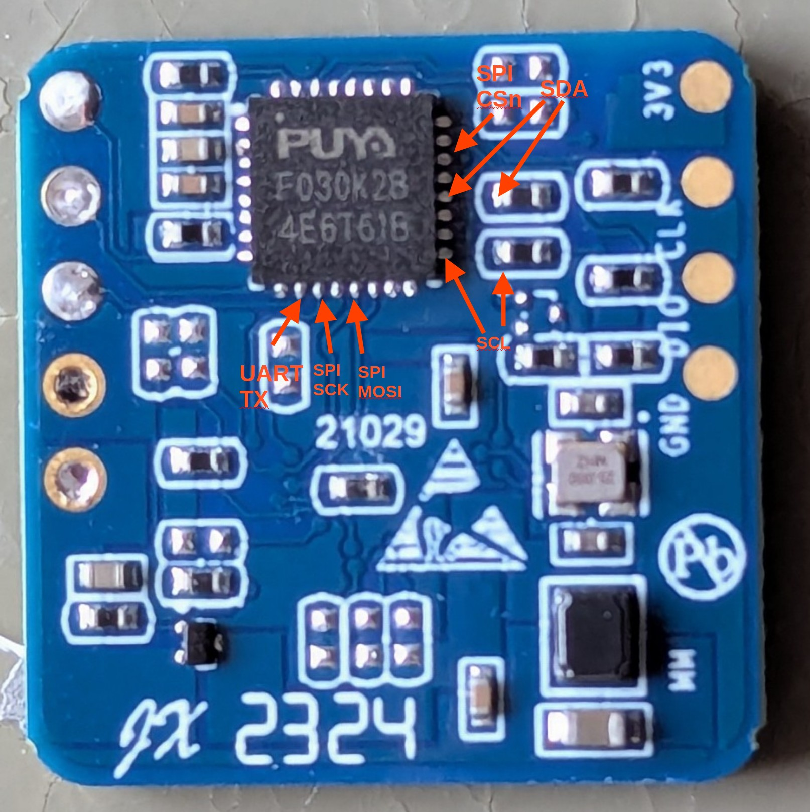

This is WIP!

# Reverse Engineering the Hi-Link LD2410S

The LD2410S is a FMCW Radar based on the 

* [ICLegend ICL1112](https://edworks.co.kr/sensor/icl1112/): 24G 1T1R mmWave Sensor SoC
- [Puya F030K28](https://download.py32.org/Datasheet/en/PY32F030_Datasheet_V1.8.pdf): Cortex-M0, 64KBytes Flash, 8 KBytes SRAM, I2C/SPI/UART

I'm not going to make any screenshots from the ICL1112 datasheet in this project as they have a huge "CONFIDENTAL" mark over them. Just visit the public website which is linked on the device name and access them by yourself.

# PCBs

## PCB Front




## PCB Back


# Bus Protocols


System diagram of the ICLegend IC1112. Taken from the public website of ICLegend.

## I2C

The I2C runs at 3MHz (sic) and seems to be used for the initial configuration and trigger of the radar scan.

After power-on 4 rapid burts in quick succession. During normal operation a burst can be seen every 2.05s.

A sniff with a Saleae can be found [here](./misc/ld2410s_i2c_saleae.sal). The power-up sequence and normal operation is visible in the trace.

Guess this is bit banged I2C as the hardware engine microcontroller only supports rates up to 400kHz. 

## SPI


The SPI runs at 10MHz clock rate. The ICL1112 acts as a SPI master.


According to the datasheet this board is using the "Range FFT data frame".


Example Frame:

```
0  10101010 00110000 00000000 00010001
1  10000000 00000000 00101001 11110111
2  01010010 11010111 11101111 11111110
3  11111111 01011111 11111111 10100011
4  00000000 00010001 11111111 11111100
5  00000000 01001010 00000000 00100100
6  00000000 00001010 11111111 11101111
7  00000000 00000010 00000000 00010010
8  00000000 00010010 11111111 11111011
9  00000000 00010101 00000000 00001101
10 00000000 00001101 11111111 11111101
11 00000000 00010010 00000000 00000100
12 00000000 00001110 00000000 00000011
13 00000000 00001101 00000000 00000100
14 00000000 00001101 00000000 00000110
15 00000000 00001010 11111111 11111010
16 00000000 00001100 00000000 00000100
17 11101100 11101110 00010000 01010101
```

Lets try to interpret them.

```
Word 0: 
 10101010 00110000 00000000 00010001
 Todo

```


```
Word 2-16: Range FFT Data


1  10000000 00000000 00101001 11110111
2  01010010 11010111 11101111 11111110
3  11111111 01011111 11111111 10100011
4  00000000 00010001 11111111 11111100
5  00000000 01001010 00000000 00100100
6  00000000 00001010 11111111 11101111
7  00000000 00000010 00000000 00010010
8  00000000 00010010 11111111 11111011
9  00000000 00010101 00000000 00001101
10 00000000 00001101 11111111 11111101
11 00000000 00010010 00000000 00000100
12 00000000 00001110 00000000 00000011
13 00000000 00001101 00000000 00000100
14 00000000 00001101 00000000 00000110
15 00000000 00001010 11111111 11111010
16 00000000 00001100 00000000 00000100
   \               / \               /
       FFT Real        FFT Imaginary

```

```
Word 16: 
 00000000 00001100 00000000 00000100
 Todo
```
